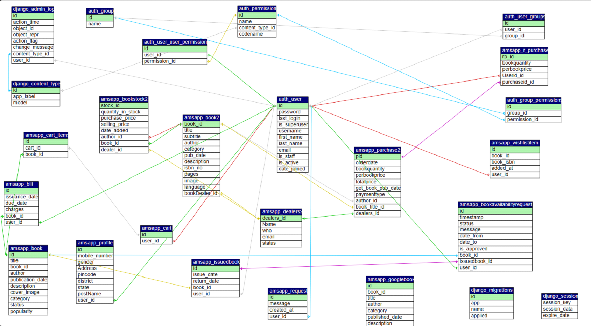
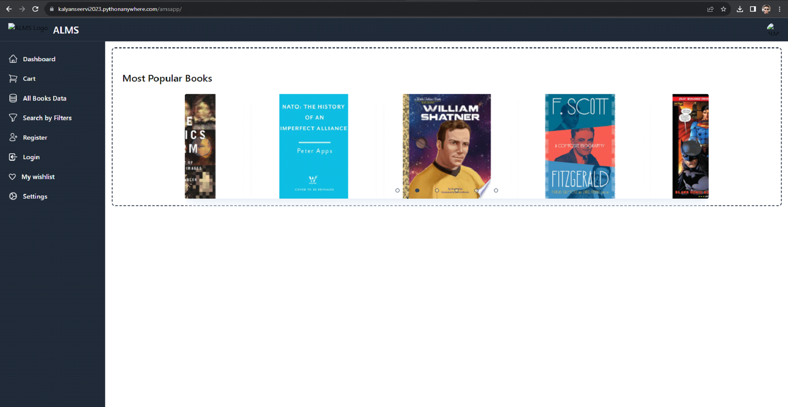

A

Project Report on

**ALM**

# **Abstract**

The title of our project is \" ALMS \". We have made an attempt to
create an e-library for users who are in need of borrowing books. The
library is designed in such a way that not only users but the admin or
the librarian could also be benefitted by having an effective management
tool to organize his environment. It has easy to handle user interface
both for admin and user both.

The objective of selecting this as project was to learn the development
of a web application using Django framework.

To meet the requirements of Database Management System and python all
under one head framework is used.

**  
**

# **Acknowledgement**

I would like to express my sincere gratitude to all the mentors of
Edunet Foundation who are guiding us through this journey of
skill-oriented learning under the IBM organisation. Special regards to
our immediate mentors Miss Mala Mishra, Master Trainer and Mr. Himanshu
Gulati, Local Trainer, Jodhpur. Both the mentors delivered the best of
their knowledge in most understandable terms to us adding their
value-based tips too. They seeded and shared creative ideas and logical
and real-time learning was most promoted. Thus, they motivated and
corrected us over our flaws thereby helping us to give beautiful outputs
for assigned tasks.

Kind regards to our training officer, Mr. Mohamed Insaf Ali Sir, who
provided us with the best environment and all the hardware and software
required for the project.

A token of gratitude to my batchmates also, who supported and encouraged
to learn new and implement it effectively.

**  
**

**Table of Contents**

|                                                        |     |
|--------------------------------------------------------|-----|
| [1. Introduction to Problem](#introduction-to-problem) |     |
| [2. Literature Review](#literature-review)             |     |
| [3. Proposed Solution](#proposed-solution)             |     |
| [4. Requirements](#requirements)                       |     |
| 4.1 Technology Stack                                   |     |
| 4.2 Hardware                                           |     |
| 4.3 Software                                           |     |
| 4.4 Project Resources                                  |     |
| 4.5 Deployment Environment                             |     |
| 5\. User Requirements                                  |     |
| 6\. Design Documentation                               |     |
| 7\. Implementation Details                             |     |
| 8\. Testing                                            |     |
| 9\. Deployment                                         |     |
| 10\. Future Scope                                      |     |
| 11\. Conclusion                                        |     |
| Appendix A Project Code                                |     |
| Appendix B Screenshot of Project                       |     |
| Appendix C abbreviation                                |     |
| References                                             |     |

**  
**

# **1. Introduction to Problem** {#introduction-to-problem}

In this era of modern technology, almost every aspect of our lives is
becoming digital, with respect to time. Humans are developing new
technology to make life easier day by day.

Our team detected a problem that in our libraries, all-over management
is being done on paper. Books, stock and readers records are maintained
offline even today. All transaction entries are being done on paper.

To take these tasks on digital platform, we made a project ALMS
(Advanced Library Management System).

**  
**

# **2. Literature Review** {#literature-review}

**Introduction**

The field of library management has undergone significant transformation
over the years, primarily due to advancements in technology and changing
user expectations. This literature review aims to explore the key
concepts, trends, and best practices in library management, providing a
foundation for the development of an effective library management
system.

**Digital Libraries and Open Access Initiatives**

The rise of digital libraries and open access initiatives has had a
profound impact on library management. Libraries are not only
repositories of physical materials but also gateways to vast digital
collections. This review will discuss the challenges and opportunities
associated with managing digital resources, copyright issues, and the
integration of open access materials into library catalogs.

**Emerging Trends in Library Management**

To stay relevant, libraries must adapt to emerging trends. This section
will discuss current trends such as the incorporation of artificial
intelligence and machine learning in library services, the adoption of
linked data and semantic web technologies for improved data
interoperability, and the role of libraries in supporting research data
management.

**Challenges and Future Directions**

Library management is not without its challenges, including budget
constraints, changing user demographics, and evolving technologies. This
section will explore the ongoing challenges faced by libraries and
suggest potential future directions for library management systems and
practices.

**  
**

## **3. Proposed Solution** {#proposed-solution}

The Online Library Management System is a software solution designed to
efficiently manage and streamline the operations of a library. This
project aims to provide a user-friendly, digital platform for both
library staff and patrons to handle a variety of tasks related to book
management, user registration, book lending, and resource discovery.

**  
**

# **4. Requirements** {#requirements}

**4.1 Technology Stack:**

\- HTML

\- CSS

\- JavaScript

\- Python (Django)

\- Django (Python framework)

\- Tailwind (CSS framework)

\- Google API

\- MySQL  
- Ajax

**4.2 Hardware Requirements:**

\- Computer Hardware:

\- A desktop or laptop computer with adequate processing power and
memory to run PyCharm smoothly.

\- Recommended hardware specifications:

\- Processor: Intel Core i5 or equivalent.

\- RAM: 8GB or more.

\- Storage: Sufficient free disk space for PyCharm and project files.

**4.3 Software Requirements:**

\- Operating System:

\- The project can be implemented on a computer running Windows, macOS,
or Linux.

\- IDE Software:

\- PyCharm Community Edition (an IDE software with features including
Python code editing, debugging, task running, version control and other
useful in-built tools.

\- XAMPP:

\- It is used to test clients or websites before publishing them to a
remote web server. On a local computer, the XAMPP server software
provides a suitable environment for testing MYSQL, PHP, Apache, and Perl
projects.

\- Web Browsers:

\- Modern web browsers like Google Chrome, Mozilla Firefox, or Microsoft
Edge for accessing online resources, documentation, and web-based
configuration interfaces. We will also use the inspect tool of browser
to found errors and warning in page.

**4.4 Project Resources:**

\- Learning Resources:

\- Access to relevant textbooks, online tutorials, and documentation for
various technologies used in this project.

\- Project Documentation:

\- Development of project-specific documentation, including step-by-step
guides, configuration templates

**4.5 Deployment Environment:**

**PythonAnywhere**

PythonAnywhere is an online integrated development environment (IDE) and
web hosting service (Platform as a service) based on the Python
programming language.\[1\] Founded by Giles Thomas and Robert Smithson
in 2012, it provides in-browser access to server-based Python and Bash
command-line interfaces, along with a code editor with syntax
highlighting. Program files can be transferred to and from the service
using the user\'s browser. Web applications hosted by the service can be
written using any WSGI-based application framework.

# **5. User Requirements** {#user-requirements}

- Electronic Device: Mobile, Laptop, Desktop or Tablet

- Web Browser

- Access to Internet

**  
**

# **6. Design Documentation** {#design-documentation}

**ER Diagram:**

{width="6.268055555555556in"
height="3.467361111111111in"}

**  
**

# **7. Implementation details** {#implementation-details}

**7.1 Home page**

This is the landing page of our web application (ALMS). There are all
the required options to navigate various pages of the app. A brief
introduction of the web application (ALM) is centrally located followed
by few buttons which redirect to different web pages of the app.

**7.2 Registration page**

Registration page is included the home page itself. This section has a
form to

register asking for user's basic details like name,

**7.3 Login page**

User and admin both can login from here. If you don't have an account,
you can go to registration page from the given link below submit button.

**7.4 Admin Dashboard**

On this page admin can review user's request for get books, and can
approve or reject requests. Admin can review the past approved requests
by clicking on Approved Requests. Bill list also can be

**7.5 User Dashboard**

on this page user can see bills of previous purchases and most popular
books in our library.

**7.6 Cart**

Books that added in cart for buying will be shown here.

**7.7 All Books Data**

This is the page where all books would be shown in a series. User can
add books to Wishlist to buy later or add to cart.

**7.8 Search by Filters**

On this page user can search for books with help of some filters like
category, author, publication year.

**7.9 Wishlist:**

All your wish listed books will be accessed from here.

**7.10 Stock Management:**

this section can be only accessed by admin. here Admin can manage books,
dealers and purchases.

**  
**

# **8. Testing** {#testing}

**8.1 Responsiveness:**

Our project website is fully responsive and compatible with any screen
resolution.

**8.2 Form Validation:**

We applied some type of validations in our project's login and
registration forms.

1.  **Registration Page:**

Before submitting form,

- All required field must not empty.

- password and confirm password values must match

- Email field must in proper format

- If you give details that already taken, registration will do not
  submit and a page will open that tells which detail is already taken.

- Registration can be successful only when all conditions satisfied.

- A pop up message will show when you submit the registration form and
  will be redirected to the home page.

2.  **Login Page:**

- Login Credentials must match with your registered details (Email and
  password)

- When login credentials matches with our Database, you will logged in
  and student Dashboards opens up.

# **9. Deployment ** {#deployment}

**PythonAnywhere**

# PythonAnywhere is an online integrated development environment (IDE) and web hosting service (Platform as a service) based on the Python programming language. Founded by Giles Thomas and Robert Smithson in 2012, it provides in-browser access to server-based Python and Bash command-line interfaces, along with a code editor with syntax highlighting. Program files can be transferred to and from the service using the user\'s browser. Web applications hosted by the service can be written using any WSGI-based application framework. {#pythonanywhere-is-an-online-integrated-development-environment-ide-and-web-hosting-service-platform-as-a-service-based-on-the-python-programming-language.-founded-by-giles-thomas-and-robert-smithson-in-2012-it-provides-in-browser-access-to-server-based-python-and-bash-command-line-interfaces-along-with-a-code-editor-with-syntax-highlighting.-program-files-can-be-transferred-to-and-from-the-service-using-the-users-browser.-web-applications-hosted-by-the-service-can-be-written-using-any-wsgi-based-application-framework.}

# ** **{width="6.268055555555556in" height="3.2534722222222223in"} {#section}

# **    ** {#section-1}

# **10. Future Scope** {#future-scope}

In future, the ALMS will be providing many more features and
functionality to users and admin both. Some oof these are mentioned
below:

- Accepting payments online while user purchasing books.

- Some penalty will apply if reader don't return the book at given time.

- Users can do advance booking of books by renowned authors to be
  launched.

**  
**

# **11. Conclusion** {#conclusion}

This website was developed using HTML, CSS, Tailwind CSS, JavaScript,
jQuery, Ajax, PHP, MySQL technology. The Assistant for Library
Management System is designed to streamline library operations and
enhance the user experience. It offers a scalable and secure platform
for managing books, users, and transactions. This project aims to
improve library efficiency and accessibility in the digital age.

**  
**

# **Appendix A ** {#appendix-a}

**Project Code:**

def index(request):

    \# Subquery to get the maximum popularity for each distinct title

    max_popularity_subquery =
Book.objects.filter(title=OuterRef(\'title\')).values(\'title\').annotate(max_popularity=Max(\'popularity\')).values(\'max_popularity\')

    \# Retrieve the most popular books based on the distinct titles and
their maximum popularity

    popular_books = Book.objects.filter(

        popularity=Subquery(max_popularity_subquery)

    ).order_by(\'-popularity\')\[:6\]

    return render(request, \'index.html\', {\'popular_books\':
popular_books})

def getdata(request):

    \# Initial data retrieval, e.g., when page loads

    api_url =
f\'https://www.googleapis.com/books/v1/volumes?q={random_query}&orderBy=newest&startIndex=0&maxResults=40&key={GOOGLE_BOOKS_API_KEY}\'

    response = requests.get(api_url)

    if response.status_code == 200:

        data = response.json()

        return render(request, \'getdata.html\', {\'data\': data})

    else:

        error_message = \'Failed to fetch data from the API\'

        return render(request, \'404.html\', {\'error_message\':
error_message})

# **Appendix B**

**Screenshot of Project:**

**Homepage:**

{width="6.268055555555556in"
height="3.2090277777777776in"}

**Registration Page:**

{width="6.268055555555556in"
height="3.2263888888888888in"}

**  
**

**Login Page:**

{width="6.268055555555556in"
height="3.202777777777778in"}

**Cart:**

{width="6.268055555555556in"
height="3.261111111111111in"}

**  
**

**Users Details:**

{width="6.268055555555556in" height="3.20625in"}

**Stock Management:**

{width="6.268055555555556in"
height="3.2006944444444443in"}

**  
**

**Search Books by Filters:**

{width="6.268055555555556in"
height="3.345833333333333in"}

**Online Books:**

{width="6.268055555555556in"
height="3.2159722222222222in"}

**  
**

**My Wishlist:**

{width="6.268055555555556in"
height="3.202777777777778in"}

**Settings:**

**  
**{width="6.268055555555556in"
height="3.2055555555555557in"}

**  
**

# **Appendix C**

**Abbreviation :**

HTML -- Hypertext Markup Language

CSS -- Cascading Style Sheet

PHP -- Hypertext Preprocessor

SQL -- Structured Query Language

AJAX -- Asynchronous JavaScript And XML
